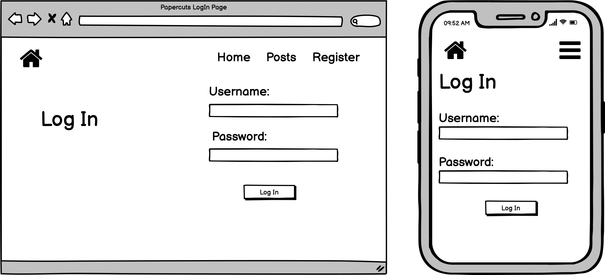
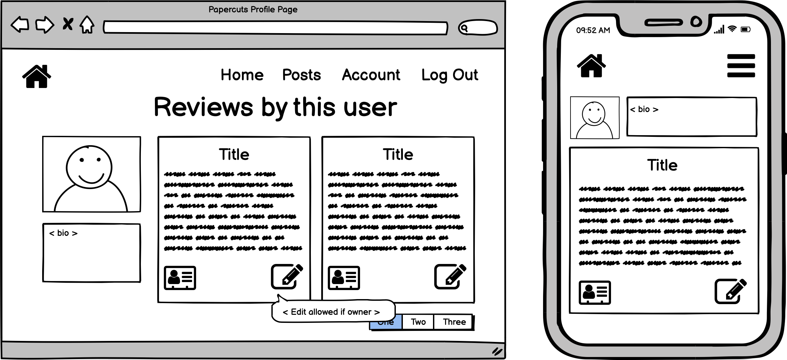
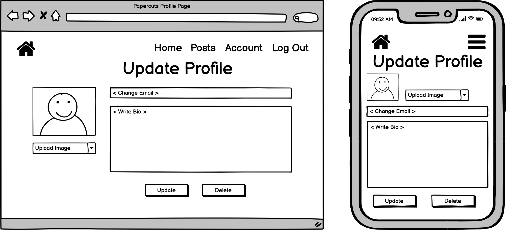
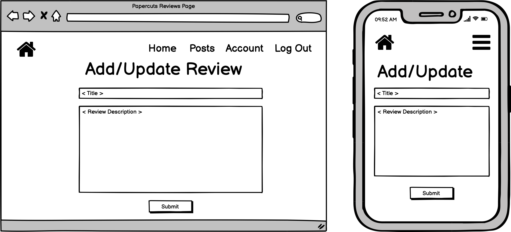
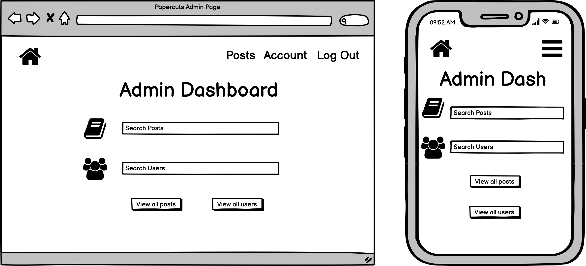

# Papercuts - Book Review Blog Project

"Papercuts" is a place user can view and vote on book reviews created by readers. The user can also create and post their 
own book reviews. The live website can be viewed [here](link).

## Table of Contents

* [User Experience Design (UX)](#User-Experience-Design)
    * [The Strategy Plane](#The-Strategy-Plane)
        * [Site Goals](#Site-Goals)
        * [User stories](#User-Stories)
    * [The Scope Plane](#The-Scope-Plane)
    * [The Structure Plane](#The-Structure-Plane)
    * [The Skeleton Plane](#The-Skeleton-Plane)
        * [Wireframes](#Wireframes)
        * [Database Design](#Database-Design)
        * [Security](#Security)
    * [The Surface Plane](#The-Surface-Plane)
        * [Design](#Design)
            * [Colour Scheme](#Colour-Scheme)
            * [Typography](#Typography)
            * [Imagery](#Imagery)
    * [Differences to Design](#Differences-to-Design)
* [Features](#Features)
    * [Existing Features](#Existing-Features)
    * [Future Features](#Features-Left-to-Implement)
* [Technologies](#Technologies)
* [Testing](#Testing)
    * [Test Strategy](#Test-Strategy)
    * [Test Results](#Test-Results)
    * [Isses and Resolutions](#Issues-and-Resolutions-to-issues-found-during-testing)
* [Deployment](#Deployment)
    * [Project Creation](#Project-Creation)
    * [GitHub Pages](#Deployment-To-Heroku)
    * [Run Locally](#Run-Locally)
    * [Fork Project]
* [Credits](#Credits)
  * [Content](#Content)
  * [Acknowledgements](#Acknowledgements)

****

## User Experience Design

### **The Strategy Plane**

- The user doesn't know what book they would like to read. Perhaps they know the genre they might like to read but 
they woudln't know exactly where to start. Alternatively, they might have just read a fantastic book and would like 
to share their opinions. Papercut is the site that will allow them to engage with other readers and 
share their personal reviews. 

- This website aims to allow the reader to quickly find book recommendations and create reviews on books they have 
read, reviews which can be seen by other users to help them make a decision on whether to read/purchase a certain 
book. All reviews are recorded and can be editted or deleted by their respective authors. The users can also add relavant 
information such as author names and links to cover page. There will be a voting feature so users can upvote their liked 
books.

#### Site Goals

- To bring together like-minded readers and allow them to express their views on a novel they enjoy or dislike.
- To help readers make a decision on what book they should read next.
- The website could conceivably look to earn income through affiliate links for these book.

#### User stories

- As a user, I immediately want to know the purpose as to why the site was made.
- As a user, I would like if the website were easy to navigate and that I never felt lost no matter where I was 
when exploring the website
- As a user, I want the website to me responsive, if I were to view it on mobile, tablet, laptop or desktop. I expect
it's content to be clear and be position accordingly.
- As a user, I want to be able to return to the main site without having to use the browser buttons so 
that I can easily return to the website if I navigate to a page that doesn't exist.
- As a user, I want to be able to register an account to the website so I can post book reviews. I also want to
be able to edit and delete the reviews I created.
- As a user, I want to be able to edit and delete the profile I created.
- As a user, I want to be able to search/filter book reviews on a custom genre or criteria as best suits me.
- As a user, I want to be able to like a review posted by another user.
- As a user, I want to be able to contact the site's owner so I can provide my feedback on the website or to have any 
queries I may have answered.

#### Admin

- As an admin I want all of the above options but I would also be able to access and delete all the reviews 
from other users.
- As an admin I want to be able to create and delete review categories.
- As an admin I want to be able to view how many users are registered on the website and delete users if 
necessary.

### **The Scope Plane**

**Features planned:**

- Responsive design.
- Website title and information on the site purpose.
- Navigation Menu (Site Wide).
- MongoDB databases to store reviews information and user logins.
- Login functionality.
- Logout functionality.
- CRUD functionality
- Book Titles and Genres displayed and searchable to all users.
- Registered user review creation and management.
- Registered Admin reviews management.

### **The Structure Plane**

#### User stories

User Story:
> As a user, I immediately want to know the purpose as to why the site was made.

Criteria:
- Site heading and Logo to be displayed on the main navigation bar on all pages.
- Home Page to display all necessary information and images to the user on the purpose of the site.

Implementation:

A site logo and header with the website name will be displayed on the main navigation menu at the top of every page. 

A detailed description of the site accompanied by relevant imagery will be displayed on the Home page so that is evident
of the websites purpose as soon as the user visits the site.

User Story:
> As a user, I would like if the website were easy to navigate and that I never felt lost no matter where I was 
when exploring the website

Criteria:
- Navigation menu to be displayed on all pages regardless of device or screen height/width.
- All navigation links redirect to the appropriate pages.

Implementation:

A navigation menu will be displayed at the top of all pages. Clicking on the menu options will redirect the users to the 
appropriate pages. On mobile devices, the menu will be collapsible icon which can be clicked to show or hide the menu 
options.

The following main pages will be implemented:

- Home page - index.html
- Sign Up Page - register.html
- Sign In Page - login.html
- Member Profile Page - profile.html
    - Edit Review Page ( Edit button accessible from users profile ) - edit-review.html
    - Delete Review Page ( Delete Button accessible from users profile ) - delete-review.html
- Reviews Page - reviews.html
- Create Review Page - create-review.html
- Contact Us Page - contact.html
- Sign Out - sign-out.html (redirects users to home page)
- Error 404 - 404.html (error 404 handling)

User Story:
> As a user, I want the website to me responsive, if I were to view it on mobile, tablet, laptop or desktop. I expect
it's content to be clear and be position accordingly.

Criteria:
- Website content should be positioned appropriately. Horizontal scroll should not be present on smaller devices.

Implementation:

Materialize will be used to style the website's containers, grids and column sizes. Suitable sizes will be utlilised to 
portray content clearly regardless of the user's device. Images will be responsive, positioned and scaled down to ensure 
it fits the screen size approprately and will not obstruct any content.

User Story:
> As a user, I want to be able to return to the main site without having to use the browser buttons so 
that I can easily return to the website if I navigate to a page that doesn't exist.

Criteria:
- If a user redirects to the wrong page, an error will display that contains a link to go back to the main website.

Implementation:

A custom 404 page will be created to assist the user to return to the website's main page.

User Story:
> As a user, I want to be able to register an account to the website so I can post book reviews. I also want
to be able to edit and delete the reviews I created.

Criteria:
- Sign up - Login and Logout functionality will be available.
- Users will be able to create, update and delete their own profiles.
- Users will be able to create, update and delete their own reviews.
- Users will have a profile page displaying their details, profile image and the reviews they have created.
- Only the creator and Admin have the ability to update or delete the creator's review.

Implementation:

Users will be able to register an account on the website via a Sign Up page. They are then required to create a username
and password. This account will set up a profile for the user with a default profile image which shall be stored in MongoDb 
under the 'users' collection.

Once an account has been established for the user, they can then post reviews. They will be allowed to edit or delete the
reviews they have posted. Only the author of the review will be able to update or delete their post so as to avoid unwanted
modifications. Flash messages will be present to inform the user of any changes.

User Story:
> As a user, I want to be able to edit and delete the profile I created.

Criteria:
- The user will be able to update their personal information as well as their profile image.
- If the user wishes, they can delete their profile and delete the reviews associated with it.

Implementation:

When the user goes to update/edit their profile information. At the bottom there will be an option to delete their account.
Before account deletion continues, the user will be asked if this is truly what they desire. The warning message will 
show the consequences of deleting their account.

User Story:
> As a user, I want to be able to search/filter book reviews on a custom genre or criteria as best suits me.

Criteria:
- The user should be able to research and read the reviews of other users as well as their own. 
- A search box will assist the user with finding certain reviews based on categories or titles.
- Search results will be sorted in descending order based on the number of likes/favorites.

Implementation:

A search box is present on the website to allow users to search for categories, types, authors, title of books. This will
then display the review results for that category, type, or title of book. This will be implemented by using a database index 
that will be created on the MongoDB collection 'reviews'.

User Story:
> As a user, I want to be able to like a review posted by another user.

Criteria:
- Posts should have display the amount of community likes for a post  
- Posts should have display the amount of community favorites for a post
- Users should be able to interact with these icons by clicking to like or favorite a post.

Implementation:

There will be a thumbs-up icon and heart icon which users can click to like or favorite a post made by another user. The 
icons wil have a number next to them which will display how many users have liked or favorited a post.

User Story: 
> As a user, I want to be able to contact the site's owner so I can provide my feedback on the website or to have 
my queries answered.

Criteria:
- Contact page should be added with a contact form. This form should only submit with valid data inputs.
- Contact form should not submit with invalid data inputs.
- User should be alerted of success/failure status of form submission.

Implementation:

A contact form will be implemented via a contact page. This will utilise the EmailJS API and will submit the user's 
request directly to the website creator. The user will receive a response depending on whether their message has been 
successfull sent or has failed through flash messages. The contact form will have validators implemented to ensure the 
correct data inputs have been used.

#### Admin User Stories

User Story:
> As an admin I want all of the above options but I would also be able to access and delete all the reviews 
from other users.

Criteria:
- The admin will have the power to edit or delete reviews when necessary e.g. when a user's post does not follow 
community guidelines.

Implementation:

An administrator's dashboard will be implemented in the website. This will be available to the admin when they log in.
The dashboard will have all of the user's functionality and will also have free reign on editting or deleting a user's 
posts.

User Story:
> As an admin of Papercuts I want to be able to create, edit and delete review categories.

Criteria:
- The admin will have the ability to create, edit or delete book categories and the contents within each category.

Implementation:

The administrator's dashboard will have the functionality to add, edit or delete categories via add-category.html, 
edit-category.html and delete-category.html.

User Story:
> As an admin of Papercuts I want to be able to view how many users are registered on the website and delete users
if necessary.

Criteria:
- The Admin Dashboard displays the number of users registered on the website. 
- The Admin has the power to delete a user when necessary e.g. if user breaks community guidelines

Implementation:

The administrator's dashboard will have the functionality to view a user's profile details and posts when researching their
account. The admin will can see and use the same buttons the user interacts with to edit or delete their post.

### **The Skeleton Plane**
#### Wireframes

- Main/Home Page:  
 

- Register:  

- Log In:  
 

- Profile:  

- Update Profile:  

- Latest Posts:  

- Add Post:  

- Admin:  

#### Database Design (MongoDb)

**Collection: categories** 

**Collection: reviews/posts** 

**Collection: users** 

#### Security

(env.py file)

### **The Surface Plane**
### Design

#### Colour Scheme

#### Typography

#### Imagery

## Differences to Design

****
## Features

### Existing Features

### Features Left to Implement

****
## Technologies

****
## Testing

### Test Strategy
#### **Summary**
Testing is required on all features and user stories documented in this README. 
All clickable links must redirect to the correct pages. All forms linked to MongoDB
must be tested to ensure they insert all given fields into the correct collections.

HTML Code must pass through the [W3C HTML Validator](https://validator.w3.org/#validate_by_uri).

CSS Code must pass through the [W3C CSS Validator](https://jigsaw.w3.org/css-validator/).

JavaScript code must pass through the [JSHint Validator](https://jshint.com/).

Python Code must pass through [PEP8 Validator](http://pep8online.com/)

#### **High Level Test Cases**

Full test results can be found [here](TESTING.md)

****
## Deployment

### Project Creation

- Project started using Github and Gitpod.

1. First I signed into Github and created a new repository. There will be a drop down menu when looking to use a template
    so I chose to use Code Institute's Template. Alternatively, you can navigate [here](https://github.com/Code-Institute-Org/gitpod-full-template)
    and there will be an option button called "Use this template".

2. I then clicked the use this template button. Where I was directed to create a new repository name and create a new 
    repository which I could open using Gitpod.

3. It creates a Gitpod workspace of which I could start developing the project.

### Version Control 

In the terminal, I utilised the following commands in the following order:

- git add . (git add <em>filename</em>) - command to add all files or a specific file 
- git commit -m <em>commit message</em> - command to commit the changes locally with a message to describe the changes briefly
- git push - command to push changes to remote Github repository

### Deployment to Heroku
**Create application:**

1. I signed into Heroku 
2. I created a new app by clicking the "new" button.
3. Select the new app 
4. Create an app project name 
5. Selected Europe as the region

**Set up connection to Github Repository:**

1. A requirements.txt needs to be created, this can be done through the following terminal command
    >  pip3 freeze --local > requirements.txt

2. Then a Procfile for Heroku is needs to be created, here is the terminal command used
    >  echo web: python app.py > Procfile

3. Ensure there the Procfile begins with a capital letter 'P' and that there are no unecessary spaces 

4. Click the deploy tab and select Github - connect to Github

5. There will be an empty input field where you can type the name of your repository. Write the repo name there and 
    click search

6. Once the repository has been found, click the connect button

**Set environment variables:**

- Click the settings button at the top of the page
- There will be an option titled 'Reveal Config Vars' - click on this 
- Here, you can add your config variable keys from your `env.py` file

<strong>Example:</strong>

- key: IP, value: 0.0.0.0
- key: PORT, value: 5000
- key: MONGO_DBNAME, value: (<em>Database name you wish to connect to</em>)
- key: MONGO_URI, value: (<em>Mongo URI - This can be found in MongoDB by going to clusters > connect > connect to your application and substituting the password and dbname that you set up in the link</em>).
- key: SECRET_KEY, value: (<em>Custom Secret Key</em>).

**Enable Automatic Deployment & Manual Deployment:**

- Ensure your Procfile and requirements.txt are in your repository as Heroku will not be able to deploy without these
- Click the Deploy tab
- Click Enable Automatic deploys in 'Automatic Deploys' section
- Choose the branch you would like to deploy and click "Deploy Branch"

### Run Locally

**Note: The project will not run locally with database connections unless the user sets up an [env.py](https://pypi.org/project/env.py/) 
file configuring IP, PORT, MONGO_URI, MONGO_DBNAME and SECRET_KEY. You must have the connection details in order to do this. 
These details are private and not disclosed in this repository for security purposes.**

### Fork Project 

****
## Credits

### Code

- CSS preload animation fix: https://css-tricks.com/transitions-only-after-page-load/

### Acknowledgements