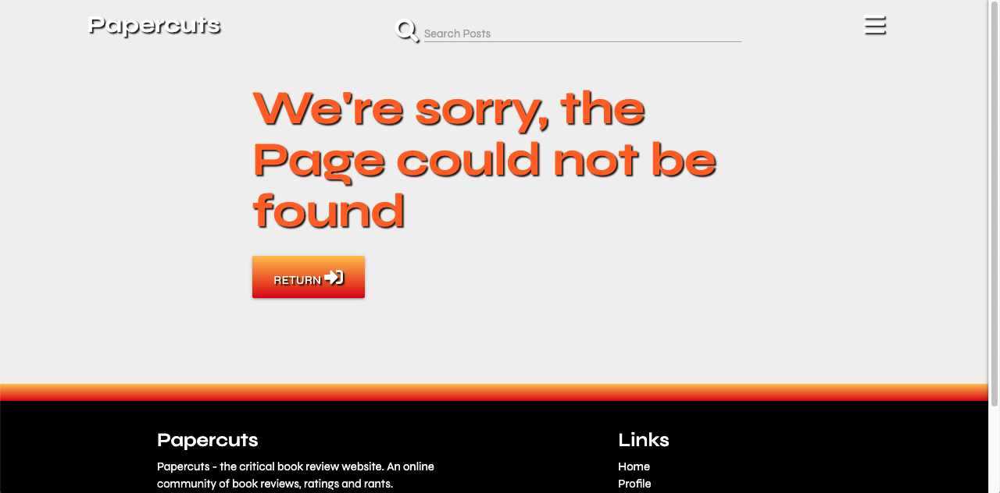

# Testing

* [User Stories](#user-stories)
* [Test and bugs during development.](#test-and-bugs-during-development)
* [Defensive programming and Security.](#defensive-programming-and-security)
* [Manual Testing](#manual-testing)
  * [Procedure and results.](#procedure-and-results)
    * [User functionality](#user-functionality)
      * [Signup and login, Create.](#signup-and-login--create)
      * [User Account, Read and Update.](#user-account--read-and-update)
    * [CRUD Functionality: Create, Read, Update, Delete.](#post--comments--and-like-functionality-create--read--update--delete)
      * [Create post](#create-post)
      * [Updating Posts.](#updating-posts)
      * [Deleting Posts.](#updating-posts)
    * [Testing the search functions](#testing-the-search-function)
    * [Testing admin genre functions](#testing-admin-category-function)
* [Validators](#validators)
    * [HTML](#html)
    * [CSS](#css)
    * [Javascript](#javascript)
    * [Python](#python)
* [Accessibility](#accessibility)
* [Known bugs](#known-bugs)

****

## User Stories

User Story:
> As a user, I immediately want to know the purpose as to why the site was made.

- Opening the website navigates the user to the [main page.](https://papercuts-project.herokuapp.com/)
- Masthead with image of a man reading 
- Text displayed to communicate the purpose of the site.

User Story:
> As a user, I would like if the website were easy to navigate and that I never felt lost no matter where I was 
when exploring the website

- Hamburger Menu is always present at the top navigation bar no matter what page the user visits.
- Every page has a heading/subheading to communicate what page the user has visited.
- All content shown on the pages are relevant to the links established to access them.

User Story: 
> As a user, I want the website to be responsive, if I were to view it on mobile, tablet, laptop or desktop. I expect
its content to be clear and be positioned accordingly.

- Website tested on mobile - website responds accordingly and lay out is clear.
- Website tested on laptop - website responds accordingly and lay out is clear.
- Website tested on iPad and iPad pro - website responds accordingly and lay out is clear.

User Story: 
> As a user, I want to be able to return to the main site without having to use the browser buttons so that I can easily return to the website if I navigate to a page that doesn't exist.

- Both Error 404(URL not Found) and Error 500(Internal Server Error )have dedicated pages to handle the errors should they arise.
- These error pages have a button which allows the user to return to the home page.

User Story: 
> As a user, I want to be able to register an account to the website so I can post book reviews. I also want to be able to edit and delete the reviews I created.

- Users can register an account through register.html
- Users can add a post through the "add post" option in the side navbar menu
- Users can also add a post through the action "plus" button on card posts or through the "plus" button in review.html
- Users can edit posts should the action button be available for them - they are always able to edit their own posts. This can be done through the button with the "pen" icon.
- Users can delete posts they created through the 'delete' option at the bottom of every post or by clicking on the button with the "trash" icon.

User Story: 
> As a user, I want to be able to edit and delete the profile I created.

- Edit their profiles through edit_profile.html - accessed through the button with the "pen" icon.
- They will be able to determine their avatar and status description through this page.
- They can delete a profile as long as they are the admin or the profile belongs to them. This can be done through the button with the "X" icon.

User Story: 
> As a user, I want to be able to search/filter book reviews on a custom genre or criteria as best suits me.

- As long as the user has signed in, there is always a search input field at the top navigation bar.
- This search input field queries for a text and finds a relating post for that text input.
- Genres are searched through the main page where there is a drop down menu to search for posts within a specific genre.

